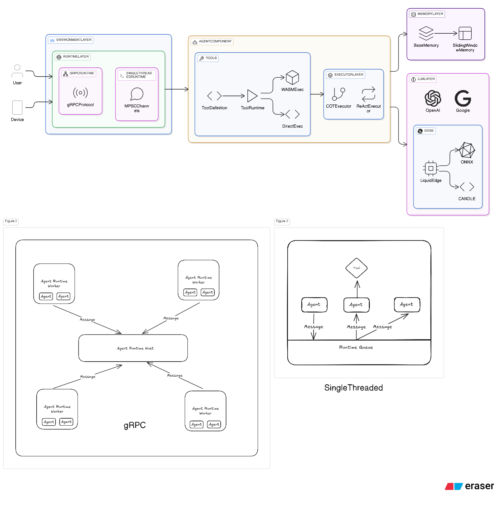

<div align="center">
  

# AutoAgents

**A Modern Multi-Agent Framework in Rust**

[](https://crates.io/crates/autoagents)
[](https://liquidos-ai.github.io/AutoAgents)
[](https://github.com/liquidos-ai/AutoAgents#license)
[](https://github.com/liquidos-ai/AutoAgents/actions)
[](https://codecov.io/gh/liquidos-ai/AutoAgents)

[Documentation](https://liquidos-ai.github.io/AutoAgents/) | [Examples](examples/) | [Contributing](CONTRIBUTING.md)
</div>

---

## 🚀 Overview

AutoAgents is a cutting-edge multi-agent framework built in Rust that enables the creation of intelligent, autonomous
agents powered by Large Language Models (LLMs) and [Ractor](https://github.com/slawlor/ractor). Designed for
performance, safety, and scalability. AutoAgents provides a robust foundation for building complex AI systems that can
reason, act, and collaborate. With AutoAgents you can create Cloud Native Agents, Edge Native Agents and Hybrid Models
as well. It is So extensible that other ML Models can be used to create complex pipelines using Actor Framework.

---

## ✨ Key Features

### 🤖 **Agent Execution**

- **Multiple Executors**: ReAct (Reasoning + Acting) and Basic executors with streaming support
- **Structured Outputs**: Type-safe JSON schema validation and custom output types
- **Memory Systems**: Configurable memory backends (sliding window, persistent storage - Coming Soon)

### 🔧 **Tool Integration**

- **Custom Tools**: Easy integration with derive macros
- **WASM Runtime for Tool Execution**: Sandboxed tool execution

### 🏗️ **Flexible Architecture**

- **Provider Agnostic**: Support for OpenAI, Anthropic, Ollama, and local models
- **Multi-Platform**: Native Rust, WASM for browsers, and server deployments
- **Multi-Agent**: Type-safe pub/sub communication and agent orchestration

### 🌐 **Deployment Options**

- **Native**: High-performance server and desktop applications
- **Browser**: Run agents directly in web browsers via WebAssembly
- **Edge**: Local inference with ONNX models

---

## 🌐 Supported LLM Providers

AutoAgents supports a wide range of LLM providers, allowing you to choose the best fit for your use case:

| Provider              | Status |
|-----------------------|--------|
| **LiquidEdge (ONNX)** | ✅      |
| **OpenAI**            | ✅      |
| **Anthropic**         | ✅      |
| **Ollama**            | ✅      |
| **DeepSeek**          | ✅      |
| **xAI**               | ✅      |
| **Phind**             | ✅      |
| **Groq**              | ✅      |
| **Google**            | ✅      |
| **Azure OpenAI**      | ✅      |

*Provider support is actively expanding based on community needs.*

---

## 📦 Installation

### Development Setup

For contributing to AutoAgents or building from source:

#### Prerequisites

- **Rust** (latest stable recommended)
- **Cargo** package manager
- **LeftHook** for Git hooks management

#### Install LeftHook

**macOS (using Homebrew):**

```bash
brew install lefthook
```

**Linux/Windows:**

```bash
# Using npm
npm install -g lefthook
```

#### Clone and Setup

```bash
# Clone the repository
git clone https://github.com/liquidos-ai/AutoAgents.git
cd AutoAgents

# Install Git hooks using lefthook
lefthook install

# Build the project
cargo build --release

# Run tests to verify setup
cargo test --all-features
```

The lefthook configuration will automatically:

- Format code with `cargo fmt`
- Run linting with `cargo clippy`
- Execute tests before commits

---

## 🚀 Quick Start

### Basic Usage

```rust
use autoagents::core::agent::memory::SlidingWindowMemory;
use autoagents::core::agent::prebuilt::executor::{ReActAgent, ReActAgentOutput};
use autoagents::core::agent::task::Task;
use autoagents::core::agent::{AgentBuilder, AgentDeriveT, AgentOutputT, DirectAgent};
use autoagents::core::error::Error;
use autoagents::core::tool::{ToolCallError, ToolInputT, ToolRuntime, ToolT};
use autoagents::llm::LLMProvider;
use autoagents::llm::backends::openai::OpenAI;
use autoagents::llm::builder::LLMBuilder;
use autoagents_derive::{AgentOutput, ToolInput, agent, tool};
use serde::{Deserialize, Serialize};
use serde_json::Value;
use std::sync::Arc;

#[derive(Serialize, Deserialize, ToolInput, Debug)]
pub struct AdditionArgs {
    #[input(description = "Left Operand for addition")]
    left: i64,
    #[input(description = "Right Operand for addition")]
    right: i64,
}

#[tool(
    name = "Addition",
    description = "Use this tool to Add two numbers",
    input = AdditionArgs,
)]
struct Addition {}

impl ToolRuntime for Addition {
    fn execute(&self, args: Value) -> Result<Value, ToolCallError> {
        println!("execute tool: {:?}", args);
        let typed_args: AdditionArgs = serde_json::from_value(args)?;
        let result = typed_args.left + typed_args.right;
        Ok(result.into())
    }
}

/// Math agent output with Value and Explanation
#[derive(Debug, Serialize, Deserialize, AgentOutput)]
pub struct MathAgentOutput {
    #[output(description = "The addition result")]
    value: i64,
    #[output(description = "Explanation of the logic")]
    explanation: String,
    #[output(description = "If user asks other than math questions, use this to answer them.")]
    generic: Option<String>,
}

#[agent(
    name = "math_agent",
    description = "You are a Math agent",
    tools = [Addition],
    output = MathAgentOutput,
)]
#[derive(Default, Clone)]
pub struct MathAgent {}

impl From<ReActAgentOutput> for MathAgentOutput {
    fn from(output: ReActAgentOutput) -> Self {
        let resp = output.response;
        if output.done && !resp.trim().is_empty() {
            // Try to parse as structured JSON first
            if let Ok(value) = serde_json::from_str::<MathAgentOutput>(&resp) {
                return value;
            }
        }
        // For streaming chunks or unparseable content, create a default response
        MathAgentOutput {
            value: 0,
            explanation: resp,
            generic: None,
        }
    }
}

pub async fn simple_agent(llm: Arc<dyn LLMProvider>) -> Result<(), Error> {
    let sliding_window_memory = Box::new(SlidingWindowMemory::new(10));

    let agent = AgentBuilder::<_, DirectAgent>::new(ReActAgent::new(MathAgent {}))
        .llm(llm)
        .memory(sliding_window_memory)
        .build()?;

    println!("Running simple_agent with direct run method");

    let result = agent.run(Task::new("What is 1 + 1?")).await?;
    println!("Result: {:?}", result);
    Ok(())
}

#[tokio::main]
async fn main() -> Result<(), Error> {
    // Check if API key is set
    let api_key = std::env::var("OPENAI_API_KEY").unwrap_or("".into());

    // Initialize and configure the LLM client
    let llm: Arc<OpenAI> = LLMBuilder::<OpenAI>::new()
        .api_key(api_key) // Set the API key
        .model("gpt-4o") // Use GPT-4o-mini model
        .max_tokens(512) // Limit response length
        .temperature(0.2) // Control response randomness (0.0-1.0)
        .build()
        .expect("Failed to build LLM");

    let _ = simple_agent(llm).await?;
    Ok(())
}
```

---

## 📚 Examples

Explore our comprehensive examples to get started quickly:

### [Basic Agent](examples/basic/)

A simple agent demonstrating core functionality and event-driven architecture.

```bash
export OPENAI_API_KEY="your-api-key"
cargo run --package basic-example -- --usecase simple
```

### [WASM Tool Execution](examples/wasm_runner/)

A simple agent which can run tools in WASM runtime.

```bash
export OPENAI_API_KEY="your-api-key"
cargo run --package wasm-runner
```

### [Coding Agent](examples/coding_agent/)

A sophisticated ReAct-based coding agent with file manipulation capabilities.

```bash
export OPENAI_API_KEY="your-api-key"
cargo run --package coding_agent -- --usecase interactive
```

---

## 🏗️ Architecture



AutoAgents is built with a modular architecture:

```
AutoAgents/
├── crates/
│   ├── autoagents/     # Main library entry point
│   ├── core/           # Core agent framework
│   ├── llm/            # LLM provider implementations
│   ├── liquid-edge/    # Edge Runtime Implementation
│   └── derive/         # Procedural macros
├── examples/           # Example implementations
```

### Core Components

- **Agent**: The fundamental unit of intelligence
- **Environment**: Manages agent lifecycle and communication
- **Memory**: Configurable memory systems
- **Tools**: External capability integration
- **Executors**: Different reasoning patterns (ReAct, Chain-of-Thought)

---

## 🛠️ Development

### Setup

For development setup instructions, see the [Installation](#-installation) section above.

### Running Tests

```bash
# Run all tests
cargo test --all-features

# Run tests with coverage (requires cargo-tarpaulin)
cargo install cargo-tarpaulin
cargo tarpaulin --all-features --out html
```

### Git Hooks

This project uses LeftHook for Git hooks management. The hooks will automatically:

- Format code with `cargo fmt --check`
- Run linting with `cargo clippy -- -D warnings`
- Execute tests with `cargo test --features full`

### Contributing

We welcome contributions! Please see our [Contributing Guidelines](CONTRIBUTING.md)
and [Code of Conduct](CODE_OF_CONDUCT.md) for details.

---

## 📖 Documentation

- **[API Documentation](https://liquidos-ai.github.io/AutoAgents)**: Complete Framework Docs
- **[Examples](examples/)**: Practical implementation examples

---

## 🤝 Community

- **GitHub Issues**: Bug reports and feature requests
- **Discussions**: Community Q&A and ideas
- **Discord**: Join our Discord Community using https://discord.gg/Ghau8xYn

---

## 📊 Performance

AutoAgents is designed for high performance:

- **Memory Efficient**: Optimized memory usage with configurable backends
- **Concurrent**: Full async/await support with tokio
- **Scalable**: Horizontal scaling with multi-agent coordination
- **Type Safe**: Compile-time guarantees with Rust's type system

---

## 📜 License

AutoAgents is dual-licensed under:

- **MIT License** ([MIT_LICENSE](MIT_LICENSE))
- **Apache License 2.0** ([APACHE_LICENSE](APACHE_LICENSE))

You may choose either license for your use case.

---

## 🙏 Acknowledgments

Built with ❤️ by the [Liquidos AI](https://liquidos.ai) team and our amazing community contributors.

Special thanks to:

- The Rust community for the excellent ecosystem
- OpenAI, Anthropic, and other LLM providers for their APIs
- All contributors who help make AutoAgents better

---

<div align="center">
  <strong>Ready to build intelligent agents? Get started with AutoAgents today!</strong>

⭐ **Star us on GitHub** | 🐛 **Report Issues** | 💬 **Join Discussions**
</div>

## Star History

[](https://www.star-history.com/#liquidos-ai/AutoAgents&Date)
