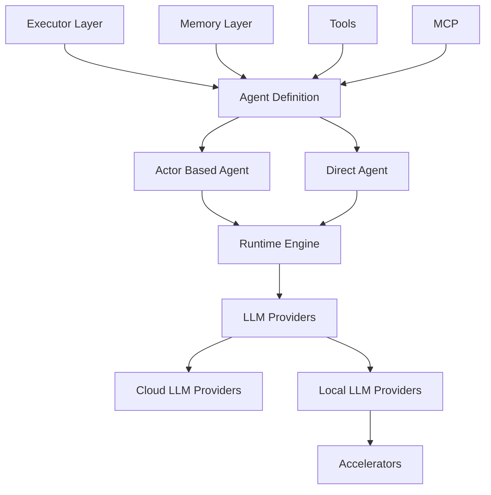

# Architecture Overview

AutoAgents is built with a modular, extensible architecture that prioritizes performance, safety, and developer experience. This document provides a comprehensive overview of the framework's design and core components.

## High-Level Architecture
Key layers:

- Agent Definition: your agent’s metadata, tools, and output
- Executors: Basic (single‑turn) and ReAct (multi‑turn with tools, streaming)
- Memory: context storage (e.g., sliding window)
- Tools/MCP: capabilities the agent can call
- Runtime: optional actor system for multi‑agent workflows
- Providers: pluggable LLM backends (cloud/local)

