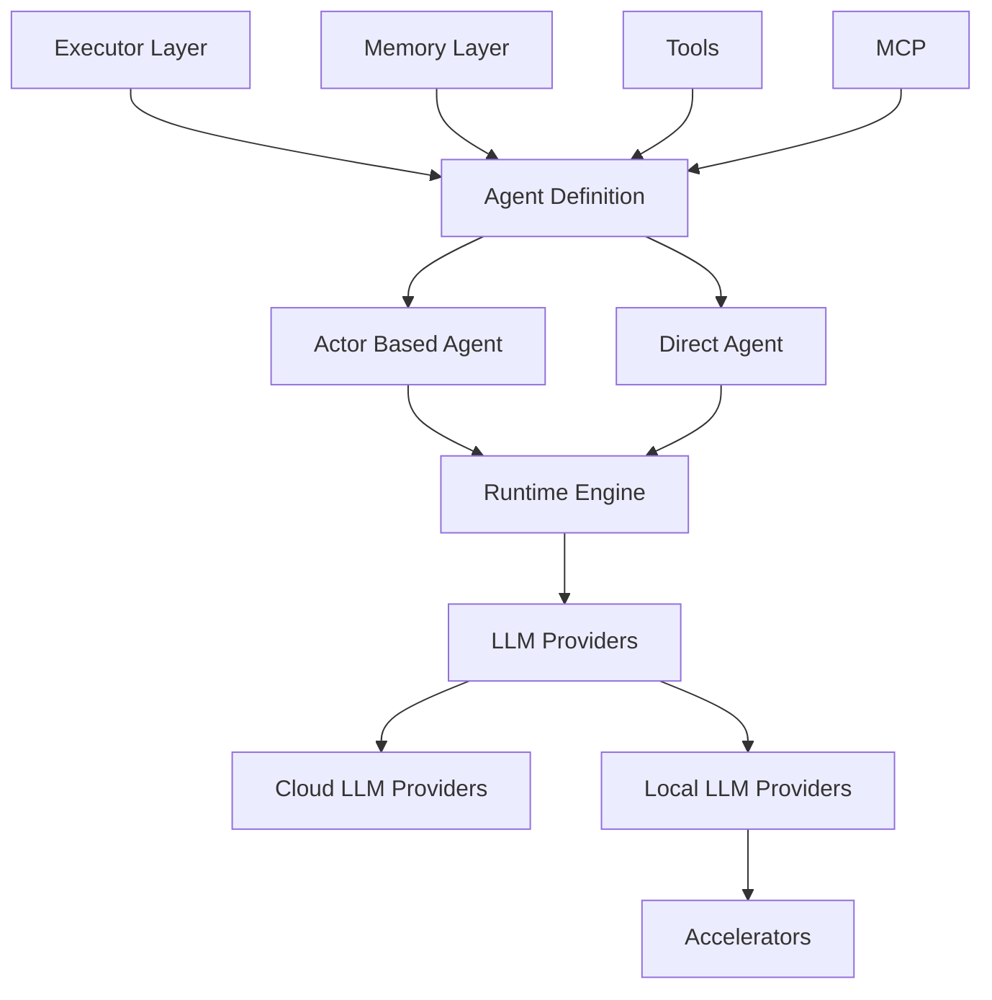

# Introduction

AutoAgents is a modern multi‑agent framework in Rust for building intelligent, autonomous agents powered by Large Language Models (LLMs/SLMs) and [Ractor](https://github.com/slawlor/ractor).

Designed for performance, safety, and scalability, AutoAgents provides a robust foundation for AI systems that can reason, act, remember, and collaborate. You can build cloud‑native agents, edge‑native agents, and hybrid deployments — including WASM for the browser.

## What Is AutoAgents?

AutoAgents helps you create agents that can:

- Reason: Use execution strategies like ReAct and Basic for problem solving
- Act: Call tools and interact with external systems safely
- Remember: Maintain context with configurable memory providers
- Collaborate: Coordinate through an actor runtime and pub/sub topics
---

## High‑Level Architecture

## Community and Support

AutoAgents is developed by the [Liquidos AI](https://liquidos.ai) team and maintained by a growing community.

- 📖 Documentation: Guides and reference
- 💬 Discord: [discord.gg/Ghau8xYn](https://discord.gg/Ghau8xYn)
- 🐛 Issues: [GitHub](https://github.com/liquidos-ai/AutoAgents)
- 🤝 Contributing: PRs welcome
